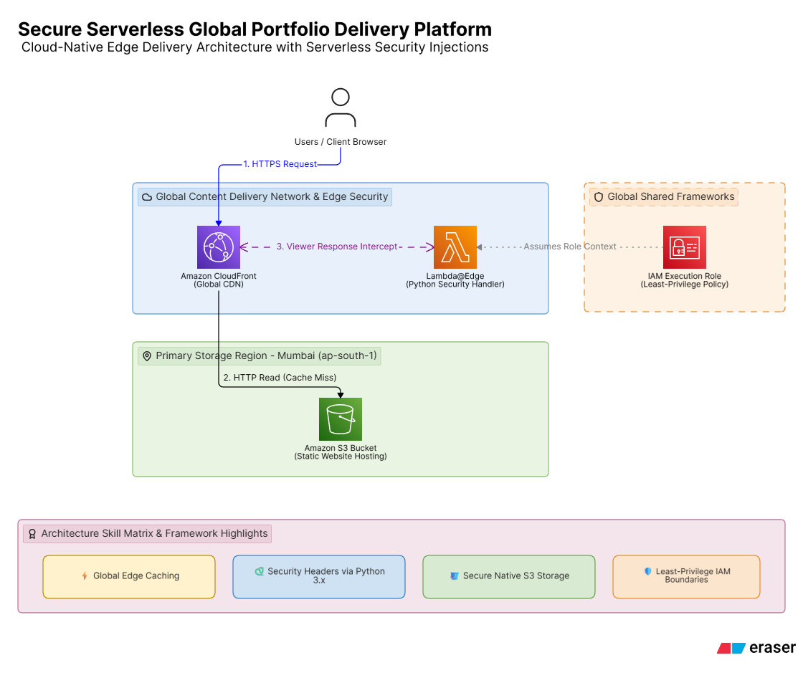
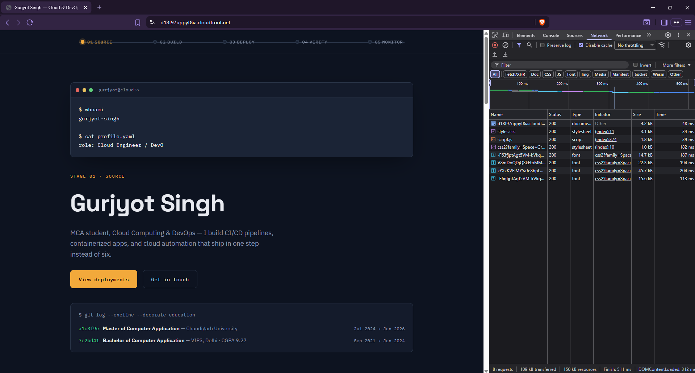
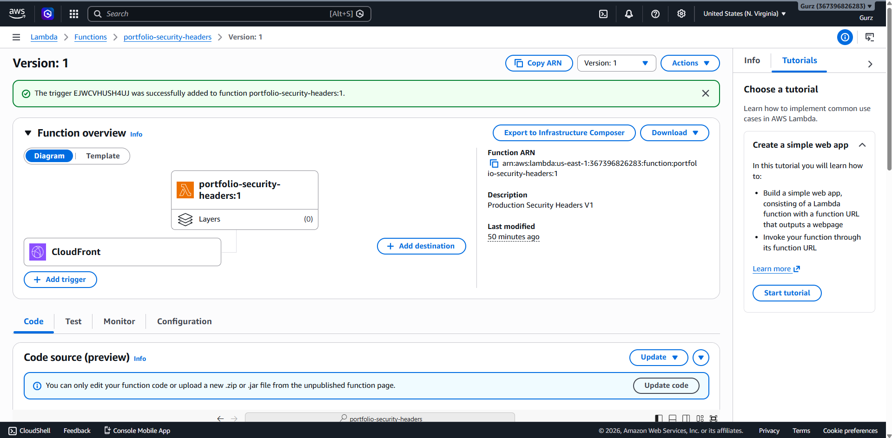
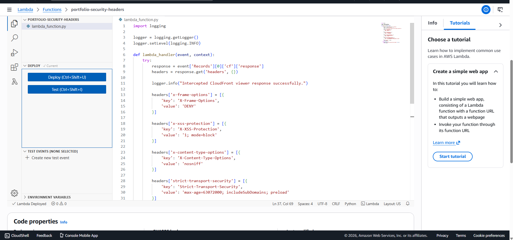

# Secure Cloud-Native Web Architecture Platform

A highly available, fault-tolerant, and globally accelerated static web infrastructure built entirely on AWS. This architecture replaces traditional server instances with cloud-native object storage, dynamic global edge delivery (CDN), and serverless edge computing to dynamically intercept traffic and inject defensive security headers.

## 🏗️ Architecture Design & Visual Walkthrough

### 1. System Topology Map
<p align="center">
  
</p>

### 2. Live Edge Verification & Response Inspection
<p align="center">
  
</p>

---

## 🛠️ Infrastructure Breakdown

* **Asset Storage Origin:** Amazon S3 (Configured for static hosting with optimized access routing).
* **Edge Delivery Pipeline:** Amazon CloudFront CDN (Configured with global edge location profiles and mandatory HTTP-to-HTTPS transport protocol redirections).
* **Serverless Compute Security:** AWS Lambda@Edge running an asynchronous Python 3.x runtime intercept handler.

### Active Edge Event Triggers
<p align="center">
  
</p>

The serverless lambda routine is tied directly to CloudFront's **Origin Response** / **Viewer Response** boundary loop. This ensures that custom security headers are evaluated at the nearest geographical edge location to the end-user, minimizing performance overhead while establishing robust protection boundaries.

---

## 🔒 Implemented Security Hardening

To protect the application frontend from standard web vulnerabilities, the Python edge script dynamically attaches the following production-grade metadata fields into the HTTP response header structure:

| Security Header | Assigned Value | Mitigation Objective |
| :--- | :--- | :--- |
| `X-Frame-Options` | `DENY` | Defends against Clickjacking exploits by blocking malicious iframe nesting. |
| `X-XSS-Protection` | `1; mode=block` | Forces modern browsers to stop page execution if a cross-site scripting attack is detected. |
| `X-Content-Type-Options` | `nosniff` | Inhibits MIME-type sniffing vulnerabilities, forcing compliance with declared asset styling. |
| `Strict-Transport-Security` | `max-age=63072000; includeSubDomains; preload` | Enforces structural HTTP Strict Transport Security (HSTS) to lock browser interactions to SSL/TLS. |

---

## 💻 Configuration & Code Repositories

### 1. Core Serverless Interceptor Core (`lambda_function.py`)
<p align="center">
  
</p>

```python
import logging

# Set up runtime logging for troubleshooting
logger = logging.getLogger()
logger.setLevel(logging.INFO)

def lambda_handler(event, context):
    try:
        # Extract the response payload from the CloudFront event
        response = event['Records'][0]['cf']['response']
        headers = response.get('headers', {})

        logger.info("Intercepted CloudFront viewer response successfully.")

        # Inject standard security headers (Requires lowercase dictionary keys)
        headers['x-frame-options'] = [{'key': 'X-Frame-Options', 'value': 'DENY'}]
        headers['x-xss-protection'] = [{'key': 'X-XSS-Protection', 'value': '1; mode=block'}]
        headers['x-content-type-options'] = [{'key': 'X-Content-Type-Options', 'value': 'nosniff'}]
        headers['strict-transport-security'] = [{'key': 'Strict-Transport-Security', 'value': 'max-age=63072000; includeSubDomains; preload'}]

        response['headers'] = headers
        return response

    except Exception as e:
        logger.error(f"Error processing security headers: {str(e)}")
        return response
